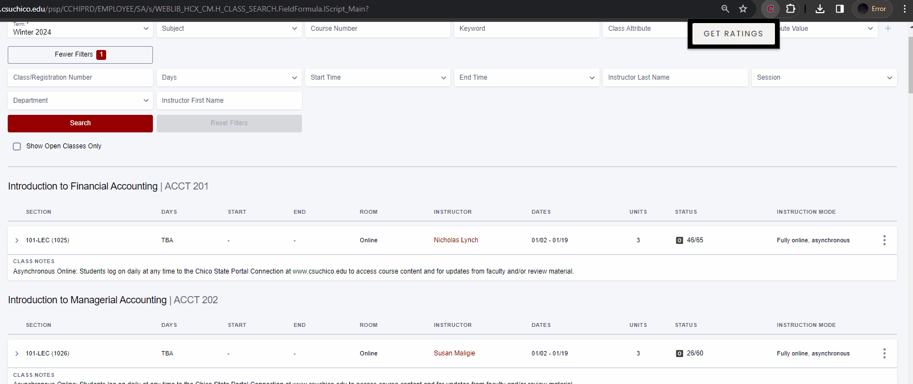

#  Chico State Auto Rate My Professor
A Chrome extension that with a click of a button shows a professor's rate my professor score next to their name, with an additional popup with more information.
<br />

<a href = "https://chromewebstore.google.com/detail/chico-state-portal-auto-r/bpgjphpemidkmnfobmdjijciacdafipe?hl=en" target = "_blank">Click Here to Download Extension</a>



## Work On It Yourself:
Clone Repo:
```sh
$ git clone git@github.com:numan-7/ChicoStateRMP-Extension.git
$ cd ChicoStateRMP-Extension
```

Install Packages:
```sh
$ npm install
```

Upload Extension to Browser:
```sh
1. Navigate to: chrome://extensions/
2. Enable Developer Mode [top right]
3. Click 'Load Unpacked' [top left]
4. Navigate to ChicoStateRMP-Extension\build
5. Click Select Folder
```

How To Run and View Changes:
<br />
_[remember to also refresh extension in browser to view changes]_
```sh
$ npm run watch
```
---
This project was bootstrapped with [Chrome Extension CLI](https://github.com/dutiyesh/chrome-extension-cli)

